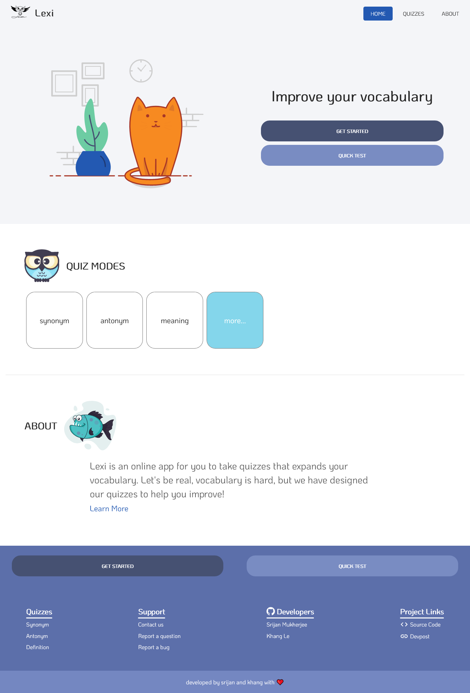
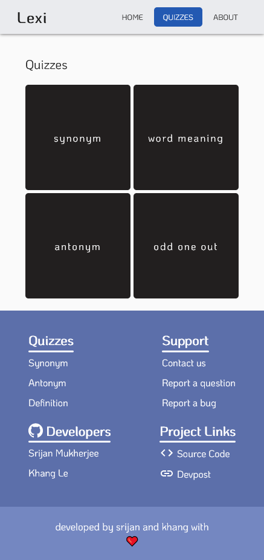

## 👨🏻‍🏫 Lexi

_Learn vocabulary. **Quickly**. **Effectively**._

Try out our webapp at [lexi.vercel.app](lexi.vercel.app)
Backend Hosted on [heroku](vocabulary-strapi-cms.herokuapp.com)
See our project on [devpost](https://devpost.com/software/lexi-axt3ei)

##### Screenshots

<figure>

<figure-caption>Home Page</figure-caption>
</figure>

<figure>

<figure-caption>Quizzes Listing Page</figure-caption>
</figure>

## ⚡ Inspiration

English is hard. Vocabulary is even harder. Trust us, from hours after hours spent on doing MCQs, we know.
Looking at how Kahoot and Merriam-Webster's quiz-based designs and Duolinguo's friendly user interface motivate others to work harder, we thought to ourselves: "Maybe there is another way to incentivize ourselves to learning English after all..."

## ⚡ What it does

The short version is: it is a quiz.

The long version is: Lexi uses data fetched from Dictionaries' API to make our quizzes accurate, our definitions solid, and designed in a way such that our users can be motivated to keep learning, and is sure to aid English learners worldwide in their quest of mastering the language!

## ⚡ Challenges we ran into

**No greatness comes without hardship.**\
In Lexi's case, it was the hours spent on reworking the UI to make everything look nice and user-friendly for both desktop and mobile users, the sleepless nights getting the server and databases up, the bug-fixing sessions that lasted too deep into the night... it was all of that - our blood, sweat, and tears shed to make a working product.

## ⚡Accomplishments that we're proud of

**Our greatest obstacles gave rise to our proudest achievements.**\
The UI is now to our taste - subtle, gentle, and appealing, our databases are running like clockwork, and Lexi has truly grown into a beautiful lady... Thinking of our disagreements over the design and making our product look nice, we are proudest of our teamwork - everything it took to make our project perfect.

## ⚡ What we learned

Over the course of this hackathon, the knowledge we gained grew beyond our knowledge of JS and its framework: we learned to collaborate, design, and learn how to make products that will (hopefully) inspire everyone in their path to education.

## ⚡ What's next for Lexi

Well, with everything said and done, we will keep expanding Lexi's lexis and implement machine learning to predict each learner's ability and tailor it to the user - like a well-fitted suit.

## 🦄 Developers

[Khang Le](https://github.com/therealozp)\
[Srijan Mukherjee](https://github.com/Srijanmukherjee007)
